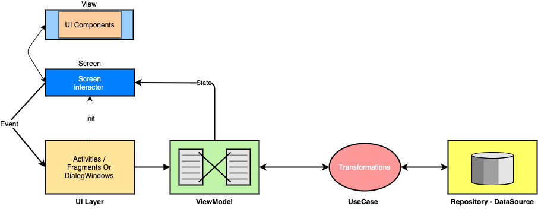

[![Contributors][contributors-shield]][contributors-url]
[![Forks][forks-shield]][forks-url]
[![Stargazers][stars-shield]][stars-url]
[![Issues][issues-shield]][issues-url]
[![MIT License][license-shield]][license-url]
[![LinkedIn][linkedin-shield]][linkedin-url]


<!-- PROJECT LOGO -->
<br />
<p align="center">
  <a href="https://github.com/aldefy/Notes-with-Kotlin-DSL">
    
  </a>
  <h3 align="center">Notes app with Kotlin DSL</h3>

  <p align="center">
    An awesome sample app to showcase some of the best Kotlin features used to build DSL's
    <br />
    <a href="https://github.com/aldefy/Notes-with-Kotlin-DSL/releases/">Get Sample app</a>
    ·
    <a href="https://github.com/aldefy/Notes-with-Kotlin-DSL_name/issues">Report Bug</a>
    ·
    <a href="https://github.com/aldefy/Notes-with-Kotlin-DSL_name/issues">Request Feature</a>
  </p>
</p>


<!-- TABLE OF CONTENTS -->
## Table of Contents

* [About the Project](#about-the-project)
  * [Built With](#built-with)
* [Getting Started](#getting-started)
  * [Prerequisites](#prerequisites)
  * [Installation](#installation)
* [Roadmap](#roadmap)
* [Contributing](#contributing)
* [License](#license)
* [Contact](#contact)


<!-- ABOUT THE PROJECT -->
## About The Project

This project showcases building a simple notes taking app in Android using latest libraries and using Kotlin language features to help build code with DSL's.

### Built With

* [Clean Arch](https://blog.cleancoder.com/uncle-bob/2012/08/13/the-clean-architecture.html)
* [RxJava2](https://github.com/ReactiveX/RxJava)
* [MVVM](https://bit.ly/2GmZICu)




<!-- GETTING STARTED -->
## Getting Started

Clone the project and review the code or simply download the apk.

### Prerequisites

Android Studio 4.1 +
Java 1.8

### Installation

1. Clone the repo
```sh
https://github.com/aldefy/Notes-with-Kotlin-DSL.git
```
2. Run the build with Android Studio


<!-- ROADMAP -->
## Roadmap

See the [open issues](https://github.com/aldefy/Notes-with-Kotlin-DSL/issues) for a list of proposed features (and known issues).


<!-- CONTRIBUTING -->
## Contributing

Contributions are what make the open source community such an amazing place to be learn, inspire, and create. Any contributions you make are **greatly appreciated**.

1. Fork the Project
2. Create your Feature Branch (`git checkout -b feature/AmazingFeature`)
3. Commit your Changes (`git commit -m 'Add some AmazingFeature'`)
4. Push to the Branch (`git push origin feature/AmazingFeature`)
5. Open a Pull Request


<!-- LICENSE -->
## License

Distributed under the Apache License 2.0 License. See `LICENSE` for more information.


<!-- CONTACT -->
## Contact

Adit Lal - [@aditlal](https://twitter.com/aditlal) - https://aditlal.dev

Open calendar : [calendar](https://calendly.com/aditlal)


<!-- MARKDOWN LINKS & IMAGES -->
<!-- https://www.markdownguide.org/basic-syntax/#reference-style-links -->
[contributors-shield]: https://img.shields.io/github/contributors/aldefy/Notes-with-Kotlin-DSL.svg?style=flat-square
[contributors-url]: https://github.com/aldefy/Notes-with-Kotlin-DSL/graphs/contributors
[forks-shield]: https://img.shields.io/github/forks/aldefy/Notes-with-Kotlin-DSL.svg?style=flat-square
[forks-url]: https://github.com/aldefy/Notes-with-Kotlin-DSL/network/members
[stars-shield]: https://img.shields.io/github/stars/aldefy/Notes-with-Kotlin-DSL.svg?style=flat-square
[stars-url]: https://github.com/aldefy/Notes-with-Kotlin-DSL/stargazers
[issues-shield]: https://img.shields.io/github/issues/aldefy/Notes-with-Kotlin-DSL.svg?style=flat-square
[issues-url]: https://github.com/aldefy/Notes-with-Kotlin-DSL/issues
[license-shield]: https://img.shields.io/github/license/aldefy/Notes-with-Kotlin-DSL.svg?style=flat-square
[license-url]: https://github.com/aldefy/Notes-with-Kotlin-DSL/blob/master/LICENSE.txt
[linkedin-shield]: https://img.shields.io/badge/-LinkedIn-black.svg?style=flat-square&logo=linkedin&colorB=555
[linkedin-url]: https://linkedin.com/in/aditlal
[product-screenshot]: snaps/default.png
